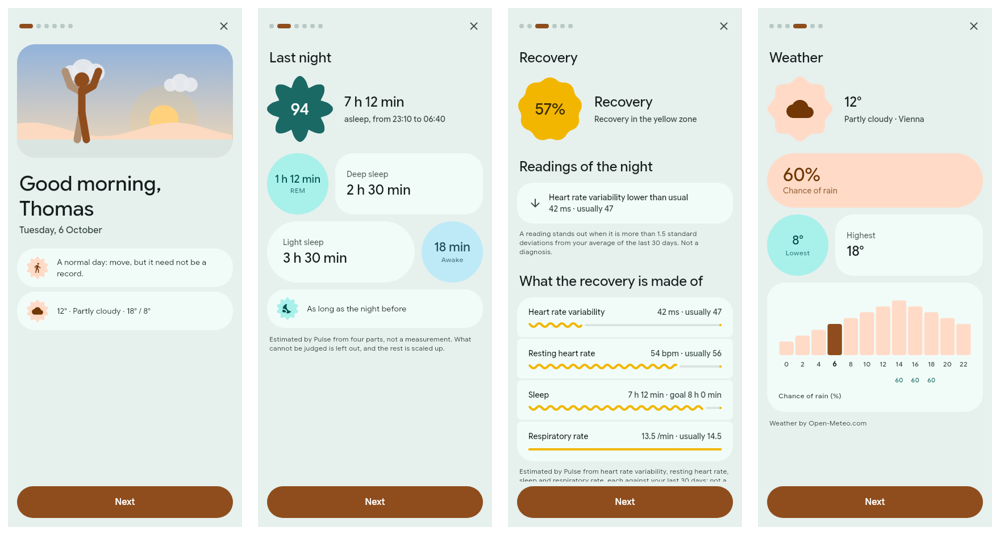
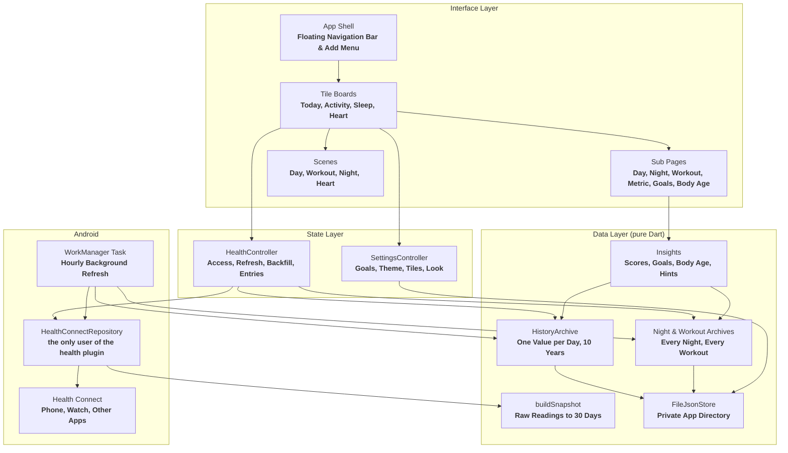

<div align="center">
  
  <h1>Pulse</h1>
  <p><strong>A health app for Android in Material 3 Expressive. It reads your data from Health Connect, keeps up to ten years of it on the phone, and sends none of it anywhere.</strong></p>

  <p>
    
    
    
    
    
    
    
    
  </p>
</div>

---


**Pulse** shows what your phone and watch already measure: steps, workouts, sleep, heart rate and the rest. It has one data source, **Health Connect**, so anything your phone, a **Fitbit** or another app writes there shows up without a second sign-in.

There is no account, no server and no analytics. The one thing Pulse asks the network for is the **weather** of the morning, and only once you set a place in the profile; your health data never leaves the phone.

The screenshots on this page show sample data.

---

## Features

- **Four Pages, One Scene Each:** **Today**, **Activity**, **Sleep** and **Heart** each open with an animated scene drawn by the app and the page's main number on a shape.
- **Good Morning:** A few cards when you get up: last night, your recovery, the weather and your goals.
- **Recovery, Day Score and Sleep Score:** Three scores from 0 to 100, each broken down into the parts it is made of.
- **Twelve Goals:** By day or by week, with streaks and a view per week, month and year.
- **Body Age:** Your real age plus or minus the years your last 30 days are worth.
- **Ten Years of History:** Every metric by day, week, month, year and in total.
- **Your Own Layout:** Remove, add, resize and reorder the tiles of every page.
- **Entries:** Add **water**, **weight** and **meals**; they are written to Health Connect.
- **Material You, Dark Theme and Liquid Glass:** The colours follow your wallpaper, and the bars can turn into refracting glass.
- **Three Languages:** **German**, **English** and **Polish**.
- **Private by Construction:** Everything stays in the app's own directory, with a backup file you save yourself.

---

## The Pages

### Today

- **The Day as a Scene:** The sky follows the time of day, and the figure stands in it at the time it is.
- **Recovery:** How rested the day began, from 0 to 100 %, in red, yellow or green. From nine in the evening the **day score** joins it.
- **Two Rings:** **Steps** outside and **active calories** inside, each against its goal, around the **body age**. A ring that reaches its goal turns into a travelling wave.
- **The Hours So Far:** Small bars from midnight to now beside each ring, and one sentence that sets your steps against yesterday at the same time.
- **Hints:** Up to three, from fixed rules over your own numbers.
- **A Page per Day:** The scores with their parts, the day in numbers with marks for a **personal best**, the night before and the workouts of that day.


### Good Morning

Like the morning brief of a watch, on the phone: the first time you open Pulse within **three hours** of getting up, a few cards to swipe through appear by themselves. They begin with a **sunrise**, behind which Pulse reads what your watch wrote since, so the night is there when the cards come. Around the time you usually get up, an alarm of the app sends a **notification**; where the hourly refresh found the night before that, it tells of it.

- **Greeting:** A morning scene whose sky shows the weather, your name, and one sentence on how hard the day should be: **easy**, **normal** or **demanding**.
- **Last Night:** Sleep score, time asleep and the stages. While the watch has not synced, the card says so.
- **Recovery:** The score with its parts, and the readings of the night that **stand out** against your last 30 days: heart rate variability, resting heart rate, respiratory rate, oxygen saturation and skin temperature.
- **Weather:** Now, highest, lowest, the chance of rain and the day in two-hour steps, for the place you set in the profile. Without a place there is no weather card and no network access.
- **Goals:** Where each goal stands and its streak, and yesterday in numbers.
- **Tonight:** When to go to bed.

Afterwards the **Good morning** tile on Today opens the cards again. One switch in the profile turns all of it off.



### Activity

- **The Latest Workout as a Scene:** A figure walks, runs, hikes, rides, swims, lifts or breathes in front of a passing landscape.
- **A Page per Workout:** Every number against the workout before and the average of the last ones, a chart of the last twelve of its kind, and marks for personal bests.
- **All Activities:** Month by month, with a filter for the kind.
- **Steps by Week and Month:** The average per day stands large above the chart.
- **Removing a Workout:** The **bin** on a workout's page takes it out of Pulse together with the steps, distance and calories counted while it ran, with an **undo**. Later, the button at the top of the list of all activities shows the removed ones and brings one back. A workout deleted in the app that recorded it disappears on its own.


### Sleep

- **The Night Played Back:** The latest night runs in twelve seconds. The sky follows the stages, and the figure snores in deep sleep, dreams in REM and sits up when you were awake.
- **Tonight:** A bedtime counted back from your usual time of getting up, a little earlier while the week is in debt.
- **A Page per Night:** The score in its four parts, the stages as blocks and against a guide range, bedtime and waking of the last 30 nights, and the sleep debt of seven.
- **Observations:** How your nights after a workout, or after a day above the step goal, differ from the others.


### Heart

- **A Heart That Beats at Your Rate:** The heart on the page swells at the last measured rate, and a monitor line passes behind the figure with one spike per beat.
- **Over the Day:** The day's heart rate as a curve from the first measurement to the last, true to time. Tap it and a bar stays at that measurement, with a pill that says the rate and the time; hold and drag, and the bar follows your finger. Each step is felt, fainter for a low rate and firmer for a high one.
- **The Day in Detail:** Tap the top of the page for the day's own page: lowest, average and highest with their times, the zones, the parts of the day, each number against the days before, hints from your own numbers, and the day hour by hour. A bar at the bottom leads to the other days that have a curve.
- **The Days Before and the Week:** Earlier days as cards to swipe and the week's averages as bars; each opens its day.
- **Vitals:** Resting heart rate, variability, blood pressure, oxygen saturation, respiratory rate and skin temperature, where your devices record them.
- **Time in Zones:** Rest, light, cardio and peak, each as its share of the measured time.


---

## Goals and Body Age

Twelve goals in four groups, each switched on and off on its own and each with its own target.

| Group | Goals | Counted Over |
| :--- | :--- | :--- |
| **Movement** | Steps, active calories, active minutes, distance, floors | A day |
| **Sleep and water** | Sleep duration, sleep score, water | A day |
| **Training** | Workouts, training time | A week from Monday |
| **Nutrition** | Calories eaten (a limit to stay under), protein | A day |

The goals page shows **today** as wavy lines, the **week** and the **month** as marks per day, and the **year** as twelve bars. A streak of two or more days or weeks is named on the goal's card.

The **body age** needs your date of birth. Its page lists every factor with your value, the value it is judged against and the years it adds or takes: steps, intensity minutes, strength training, sleep duration and rhythm, resting heart rate, heart rate variability, blood pressure, and body fat or body mass index.


---

## Look and Feel

- **Material 3 Expressive:** Few containers, heavy free-standing type, shapes that mean something, and motion on springs. Numbers count up, rings and bars fill, tiles come in one after the other.
- **One Accent per Page:** Each of the four pages has its own tone, and its sub pages keep it.
- **Navigation You Can Drag:** Drag the selected pill of the floating bar to another page. The period tabs work the same way.
- **Predictive Back:** A page shrinks under your finger and shows what is beneath before you let go.
- **Material You:** The colour scheme follows your wallpaper, or the app's own palette. Light, dark or system.


Three switches in the profile change the look further, all **off by default**:

| Switch | Effect |
| :--- | :--- |
| **Liquid Glass** | The navigation bar, the period tabs, the add button with its menu and the floating buttons become clear glass that bends the page beneath; tiles become translucent |
| **Edge-to-edge scene** | The scene of each main page runs from the top of the screen behind the title |
| **Flex font** | Large numbers and titles use the width and weight axes of **Google Sans Flex** |


---

## Your Data

- **Entries:** **Water**, **weight** and **meals** from the **+** button, written to Health Connect. The water tile adds a glass of **250 ml** with one tap. Your own entries can be edited and deleted.
- **Tiles:** In edit mode every tile has a **minus**; a list below offers what you removed and every measurement with data. Hold a tile to drag it. A measurement tile is **small** or **large**.
- **History:** One value per day and metric for up to **ten years**. Data already in Health Connect is loaded once on first start.
- **Background Refresh:** About once an hour, so no day is lost when the app stays closed.
- **Backup:** **Profile → Backup** writes history, nights, workouts and settings into one JSON file at a place you choose, and reads such a file again without overwriting what is already there.
- **Languages:** Numbers, dates and plurals follow the language (**7.432** / **7,432** / **7 432**). On **Android 13** and newer the choice is Android's own per-app language.

---

## Getting Started

### Download

Signed APKs are on the [**Releases**](https://github.com/tomsliikee/pulse/releases) page. Pulse is in **beta**: download the latest `pulse-v….apk`, open it on the phone and allow your browser or file manager to install apps once. You need **Android 8.0** or newer and **Health Connect**.

An APK you built yourself is signed with another key, so Android will not update it with a release. Save a backup in **Profile → Backup**, uninstall, install the release and read the backup again.

### Build from Source

You need the **Flutter SDK** 3.47 or newer, the **Android SDK** with platform tools, and a phone with **Health Connect** (built into **Android 14** and newer, an app from the Play Store before that).

**1. Clone and fetch dependencies:**
```bash
git clone https://github.com/tomsliikee/pulse.git
cd pulse
flutter pub get
```

**2. Run on a connected phone:**
```bash
flutter run -d android
```

**3. Or build and install an APK:**
```bash
flutter build apk --release
adb install -r build/app/outputs/flutter-apk/app-release.apk
```

Without `android/key.properties` the release build is signed with the debug key; [`docs/releasing.md`](docs/releasing.md) describes the release key and how a release is made.

On first start the app asks for access to Health Connect, then once for older data. Both dialogs belong to the system, and the app works with whatever you allow.

**Run the checks:**
```bash
flutter analyze
flutter test
```

### Permissions

| Permission | Why |
| :--- | :--- |
| **26 `READ_*`** health permissions | One per data type the app shows |
| **`WRITE_HYDRATION`**, **`WRITE_WEIGHT`**, **`WRITE_NUTRITION`** | The three kinds of entries you can add |
| **`READ_HEALTH_DATA_HISTORY`** | Loading data older than 30 days once. If declined, history grows from today |
| **`READ_HEALTH_DATA_IN_BACKGROUND`** | The hourly refresh. If declined, data is refreshed when the app is opened |
| **`POST_NOTIFICATIONS`** | The notification that says good morning. Asked for after the cards first opened by themselves; if declined, they still open in the app |
| **`RECEIVE_BOOT_COMPLETED`** | Sets the alarm for that notification again after the phone restarted |
| **`INTERNET`** | The weather and the search for a place, both from **Open-Meteo**. Not used until a place is set |

---

## How It Works

One file in the code base talks to the **`health`** plugin. Everything above it works on plain Dart values and is covered by **722** unit and widget tests that need no device.



### Measurements

**32** metrics in five groups. A day's value is the **sum** of the day, the **average** of its readings, or the **last** reading.

| Group | Metrics | Day Rule |
| :--- | :--- | :--- |
| **Activity** | Steps, distance, floors, active calories, total calories, intensity minutes | **Sum** |
| **Activity** | Speed | **Average** |
| **Vitals** | Heart rate, heart rate variability, oxygen saturation, respiratory rate, blood glucose, body temperature, skin temperature | **Average** |
| **Vitals** | Resting heart rate, blood pressure | **Last** |
| **Body** | Weight, height, body mass index, body fat, lean mass, body water, basal metabolic rate | **Last** |
| **Sleep** | Sleep duration, with stages where the source records them | **Sum** |
| **Nutrition** | Water, calories eaten, carbohydrates, protein, fat, fibre, sugar | **Sum** |

**Workouts** are read as sessions with type and duration; their steps, distance and calories are Health Connect's own totals of that time. **Intensity minutes** are estimated from the heart rate when no source writes them: a minute in the moderate range counts once, a vigorous one twice.

Every metric has the tabs **Today**, **Yesterday**, **Week**, **Month**, **Year** and **All**. An average counts only days with data; a day without a measurement is not a zero.

### The Scores

All three are the app's own estimates, since Health Connect stores none. A part that cannot be judged is left out and the rest scaled to a hundred.

| Score | Parts and Weights | Judged Against |
| :--- | :--- | :--- |
| **Recovery** | Heart rate variability **50**, resting heart rate **20**, sleep **20**, respiratory rate **10** | Your own average of the 30 days before, and the sleep goal |
| **Day score** | Movement **40**, sleep **35**, resting heart rate **15**, water **10** | Your goals, last night's sleep score and your usual resting heart rate |
| **Sleep score** | Time asleep **40**, deep and REM **25**, efficiency **20**, bedtime **15** | The sleep goal, typical stage shares and your bedtime of the week before |

Two smaller rules belong to the morning. A reading of the night **stands out** when it lies more than **1.5 standard deviations** from your average of the 30 days before. The **effort** of the day is easy on a red recovery, or on a yellow one after two days of training in a row; demanding on a green one unless you trained on each of the last three days; and normal otherwise.

### Data Storage & Disk Paths

Everything is kept in the app's private directory, **`/data/data/at.haiden.pulse/files/`**. Uninstalling the app deletes it, which is what the backup file is for.

| File | Purpose |
| :--- | :--- |
| **`snapshot.json`** | The last 30 days in full: daily values, sleep stages, heart samples, workouts, entries |
| **`history-YYYY.json`** | One value per day and metric for that calendar year, for ten years |
| **`nights-YYYY.json`** | Every night that ended in that year: its times and the minutes in each stage |
| **`workouts.json`** | Every workout the app has seen, and the ones removed by hand |
| **`settings.json`** | Goals, profile, theme, look switches, tile order and sizes |
| **`sync.json`** | When the last background refresh ran and how long it took |
| **`weather.json`** | The last forecast of today, so the service is asked at most once an hour |
| **`morning.json`** | The day the morning's notification was last sent |

---

## Platform Support Matrix

| Platform | Runner | Status |
| :--- | :--- | :--- |
| **Android 8.0+** (API 26) | **`android/`** | ***Tested*** on a **Pixel 10 Pro** with real Health Connect data and on an **Android 17** emulator |
| **Linux** | **GTK3** (`linux/`) | ***Built.*** For development only; it has no health data source and shows a notice |
| **iOS, macOS, Windows, Web** | none | Not supported. Health Connect exists only on Android |

---

## Good to Know

- **Not Medical Advice:** The scores, the body age and the hints are estimates from fixed rules. The weights are constants of this app and are not validated.
- **Other Apps' Records:** Pulse can edit and delete only its own entries; Health Connect does not let an app change another app's records.
- **Heart Rate Samples:** Single samples are kept for the last **8 days**; older days keep their resting heart rate and daily values.
- **Not Read:** Elevation gained, power, **VO2 max**, bone mass and mindfulness sessions, because the **`health`** plugin cannot read them on Android. Cycle tracking and medical records are deliberately not requested.
- **Weather:** Forecast and place search come from [Open-Meteo](https://open-meteo.com). A request carries the coordinates of the place you picked and nothing else; the place is one you type, not your location.
- **Orientation:** Portrait only.

---

## Dependencies

| Package | Used For |
| :--- | :--- |
| **`material_ui`** | The Material widget library |
| **`m3e_core`** | Material 3 Expressive components: floating toolbar, FAB menu, shapes, wavy progress |
| **`motor`** | Spring motion |
| **`health`** | Health Connect |
| **`workmanager`** | Background refresh |
| **`dynamic_color`** | The system colour palette |
| **`liquid_glass_renderer`** | The refracting glass of the Liquid Glass switch |
| **`path_provider`** | The private directory |
| **`flutter_localizations`**, **`intl`** | Translations from **`lib/l10n/app_*.arb`**, numbers and dates per language |

The bundled typeface is **Google Sans Flex**, under the **SIL Open Font License** (see [`assets/fonts/OFL.txt`](assets/fonts/OFL.txt)).

---

## License

Released under the **MIT License**, see [`LICENSE`](LICENSE).
