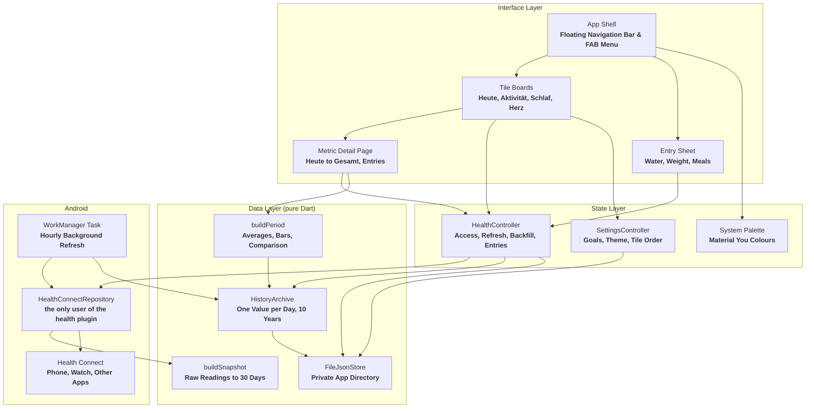
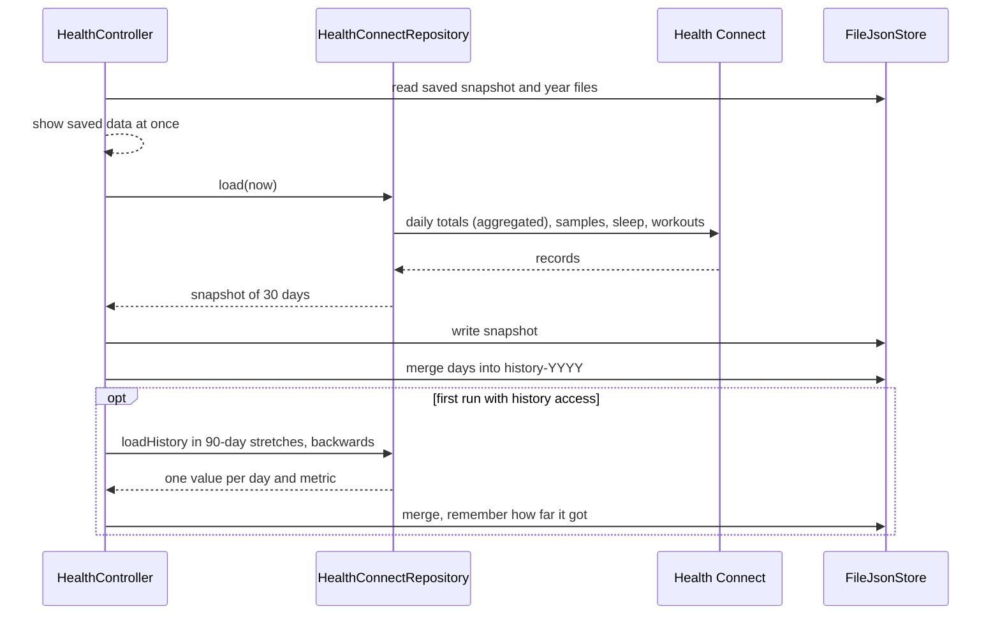
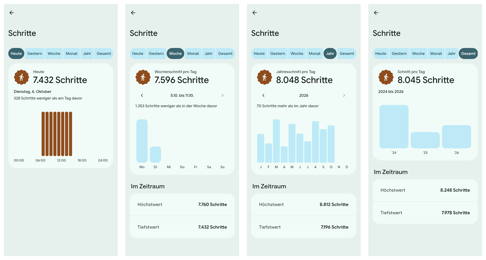
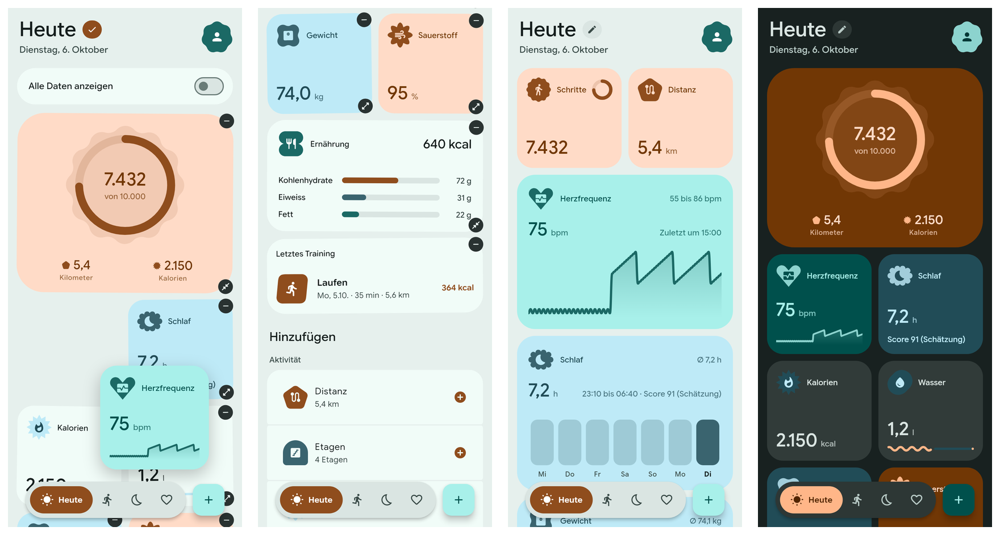

<div align="center">
  
  <h1>Pulse</h1>
  <p><strong>A health app for Android in Material 3 Expressive. It reads your data from Health Connect, keeps up to ten years of daily values on the phone, and sends nothing anywhere.</strong></p>

  <p>
    
    
    
    
    
    
  </p>
</div>

---


The screenshots on this page are rendered by the widget tests from **fixture data**, not from a person's health records.

---

## Architecture Overview

**Pulse** is a **Flutter** app with one data source: **Health Connect** on the phone. There is no server, no account and no analytics. One file in the code base talks to the **`health`** plugin; everything above it works on plain Dart values and is tested without a device.



### How a Refresh Flows



---

## Core Capabilities

- **Health Connect as the Only Source:** Steps, distance, calories, sleep, heart rate and the rest come from **Health Connect**, so data from the phone, a **Fitbit** or any other app that writes there shows up without a separate sign-in.
- **No Double Counting:** Daily totals use Health Connect's own **aggregation**, which removes the overlap when a phone and a wearable both count the same steps.
- **Four Pages of Tiles:** **Heute**, **Aktivität**, **Schlaf** and **Herz**. **Heute** always shows the current day.
- **Your Own Heute Page:** In edit mode every tile has a **minus** to remove it, and a list below the board offers every measurement Health Connect has data for, each with a **plus**. Every tile comes in two sizes: **small** (half width, the value) and **large** (full width, with the last seven days as bars, or today's curve for the heart rate).
- **Latest Value for Rare Measurements:** Weight, blood pressure, the one resting heart rate a day and similar show the most recent reading with its day instead of a dash when there is none today. Totals such as steps stay strictly on today.
- **Period Tabs on Every Metric:** Tapping a tile opens **Heute**, **Gestern**, **Woche**, **Monat**, **Jahr** and **Gesamt**, each with its average, a bar chart, the highest and lowest value, a sentence comparing it to the span before, and arrows to page back.
- **Ten Years of History:** One value per day and metric is kept in one **JSON** file per calendar year. Older data already in Health Connect is loaded once, in **90-day** stretches.
- **Edit Mode:** The pencil next to a page title makes the tiles wiggle. Hold one and drag it; the others move out of the way and the order is saved per page.
- **All Measurements on Demand:** A switch that only appears in edit mode appends every metric with data to the **Heute** page, grouped by kind.
- **Own Entries:** Add **water**, **weight** and **meals** (calories, carbohydrates, protein, fat, fibre, sugar) from the **+** button. They are written to Health Connect. Entries made by Pulse can be edited and deleted; entries from other apps are shown but cannot be changed, because Health Connect does not allow it.
- **Material You:** The colour scheme follows the phone's wallpaper. It can be switched off in the profile, which falls back to the app's own palette. Light, dark or system.
- **Background Refresh:** A **WorkManager** task refreshes the stored data about once an hour, so the app opens with current values and no day is lost if it stays closed for longer than Health Connect's 30-day window.
- **Haptics:** Distinct feedback for selecting, tapping, lifting a tile and confirming.
- **Spring Motion and Shapes:** Page changes, tile movement and the container transform into a detail page run on **Material 3 Expressive** spring tokens; badges and the profile button use the expressive shape set.





---

## Measurements

**33** metrics in five groups. A day's value follows one rule per metric: the **sum** of the day, the **average** of its readings, or the **last** reading.

| Group | Metrics | Day Rule |
| :--- | :--- | :--- |
| **Activity** | Steps, distance, floors, active calories, total calories, intensity minutes | **Sum** |
| **Activity** | Speed | **Average** |
| **Vitals** | Heart rate, heart rate variability, oxygen saturation, respiratory rate, blood glucose, body temperature, skin temperature | **Average** |
| **Vitals** | Resting heart rate, blood pressure (systolic, diastolic) | **Last** |
| **Body** | Weight, height, body mass index, body fat, lean mass, body water, basal metabolic rate | **Last** |
| **Sleep** | Sleep duration, with stages where the source records them | **Sum** |
| **Nutrition** | Water, calories eaten, carbohydrates, protein, fat, fibre, sugar | **Sum** |

Workouts are read as sessions with type, duration, distance and calories.

**Not included:** elevation gained, power, **VO2 max**, bone mass and mindfulness sessions, because the **`health`** plugin cannot read them on Android. Cycle tracking and medical records are deliberately not requested.

---

## Period Tabs

| Tab | Bars | Headline |
| :--- | :--- | :--- |
| **Heute** / **Gestern** | Hours of the day, where available | The day's value |
| **Woche** | Monday to Sunday | Average per day |
| **Monat** | Days of the month | Average per day |
| **Jahr** | Twelve months | Average per day |
| **Gesamt** | Years, up to ten | Average per day |

An average counts only days **with** data; a day without a measurement is not a zero. Month and year bars show the daily average, so a month that has just begun does not look smaller than a full one.

---

## Platform Support Matrix

| Platform | Runner | Status |
| :--- | :--- | :--- |
| **Android 8.0+** (API 26) | **`android/`** | ***Tested*** in part: on a **Pixel 10 Pro** the app read 30 days of real data and loaded older data back to 2017; steps and energy agreed with the Fitbit app once it had synced to Health Connect. Writing, editing and deleting an entry have ***not*** been tested on a device yet |
| **Linux** | **GTK3** (`linux/`) | ***Built.*** For development only; it has no health data source and shows a notice |
| **iOS, macOS, Windows, Web** | none | Not supported. Health Connect exists only on Android |

Everything above the plugin is ***tested*** by **115** unit and widget tests against an in-memory fixture store, at **360 x 640** and **412 x 915**.

---

## Permissions

| Permission | Why |
| :--- | :--- |
| **26 `READ_*`** health permissions | One per data type listed above |
| **`WRITE_HYDRATION`**, **`WRITE_WEIGHT`**, **`WRITE_NUTRITION`** | The three kinds of entries you can add |
| **`READ_HEALTH_DATA_HISTORY`** | Loading data older than 30 days once. If declined, history only grows from today |
| **`READ_HEALTH_DATA_IN_BACKGROUND`** | The hourly refresh. If declined, data is refreshed when the app is opened |

Neither the app's manifest nor those of its plugins declare the **`INTERNET`** permission for a release build.

---

## Prerequisites

- **Flutter SDK** 3.47 or newer (**Dart** 3.13).
- **Android SDK** with platform tools, and a phone with **Health Connect** (built into Android 14 and newer; an app from the Play Store before that).
- For the Linux development build on **Fedora**:
  ```bash
  sudo dnf install clang cmake ninja-build gtk3-devel
  ```

---

## Building and Running

**1. Clone the repository:**
```bash
git clone https://github.com/tomsliikee/pulse.git
cd pulse
```

**2. Fetch dependencies:**
```bash
flutter pub get
```

**3. Run the checks:**
```bash
flutter analyze
flutter test
```

**4. Run on a connected phone:**
```bash
flutter run -d android
```

**5. Build and install an APK:**
```bash
flutter build apk --debug
adb install -r build/app/outputs/flutter-apk/app-debug.apk
```

On first start the app asks for access to Health Connect, then once for older data. Both dialogs belong to the system; the app works with whatever you allow.

---

## Data Storage & Disk Paths

Everything is kept in the app's private support directory (**`/data/data/at.haiden.pulse/files/`**). Uninstalling the app deletes it; there is no export yet.

| File | Purpose |
| :--- | :--- |
| **`snapshot.json`** | The last 30 days in full: daily values, sleep stages, heart samples, workouts, entries |
| **`history-YYYY.json`** | One value per day and metric for that calendar year. Files older than ten years are removed at start |
| **`settings.json`** | Goals, theme, the Material You switch, tile order per page, the tiles on Heute and their sizes |
| **`backfill.json`** | How far back the one-time load of older data has reached |

Every value read from disk or from Health Connect is checked against the bounds in the metric catalog; a reading outside them is dropped.

---

## Known Limits

- **Heart rate:** single samples are loaded for the last **8 days**. The daily average is therefore not backfilled and only builds up from use; resting heart rate is.
- **Hourly bars:** only for steps, distance, active and total calories, water and intensity minutes.
- **Sleep score:** the app's own estimate from duration and stages. Health Connect stores none.
- **Language:** the interface is German and not yet translatable.
- **Orientation:** the layout is made for portrait and is not locked to it.

---

## Dependencies

| Package | Used For |
| :--- | :--- |
| **`material_ui`** | The Material widget library |
| **`m3e_core`** | Material 3 Expressive components: floating toolbar, FAB menu, toggle button group, shapes, wavy progress |
| **`motor`** | Spring motion |
| **`health`** | Health Connect |
| **`workmanager`** | Background refresh |
| **`dynamic_color`** | The system colour palette |
| **`path_provider`** | The private directory |

The bundled typeface is **Google Sans Flex**, under the **SIL Open Font License** (see [`assets/fonts/OFL.txt`](assets/fonts/OFL.txt)).
