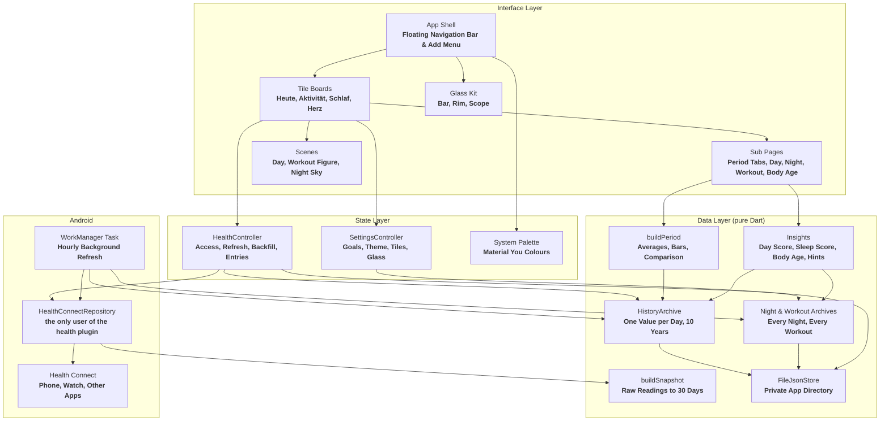
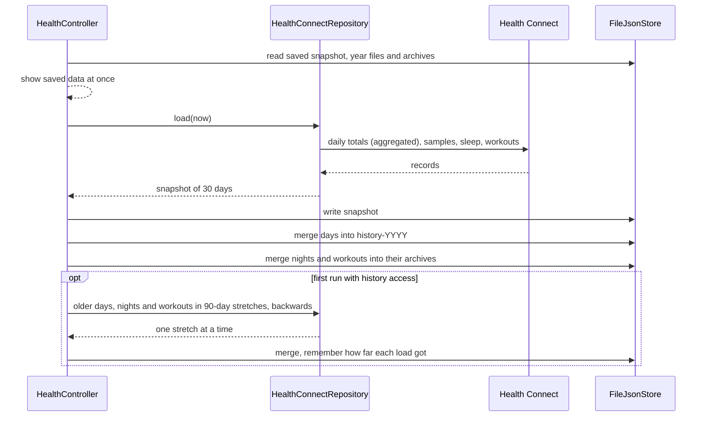
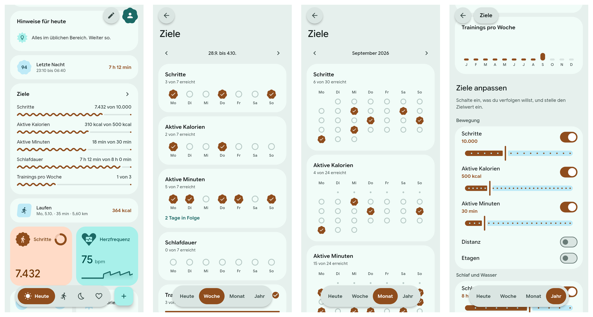
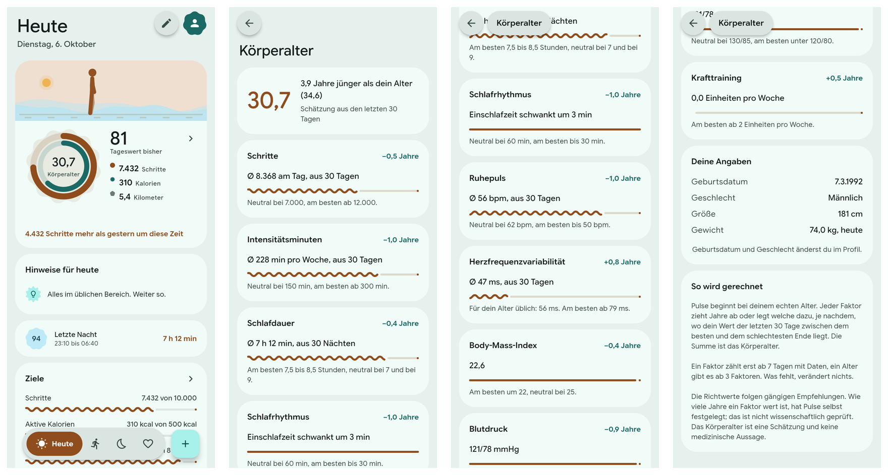

<div align="center">
  
  <h1>Pulse</h1>
  <p><strong>A health app for Android in Material 3 Expressive. It reads your data from Health Connect, keeps up to ten years of it on the phone, and sends nothing anywhere.</strong></p>

  <p>
    
    
    
    
    
    
    
    
  </p>
</div>

---


Every image on this page is rendered by the widget tests from **fixture data**, not from a person's health records. The page names are the German ones; the app also speaks English and Polish.

---

## What It Is

**Pulse** is a **Flutter** app with one data source: **Health Connect** on the phone. Steps, sleep, heart rate, workouts and the rest arrive from the phone, a **Fitbit** or any other app that writes there, without a separate sign-in. There is no server, no account and no analytics, and a release build does not hold the **`INTERNET`** permission.

| Page | Shows | Opens |
| :--- | :--- | :--- |
| **Heute** | The day as an animated scene with its score, hints, last night, the latest workout, goals, and the user's own tiles | One day, the list of all days, a metric's period tabs, the body age |
| **Aktivität** | The latest workout as an animated scene, the five before it, activity metrics | One workout, the list of all workouts |
| **Schlaf** | The latest night played back, the five before it, a bedtime for tonight | One night, the list of all nights |
| **Herz** | Heart rate, resting heart rate, variability and the other vitals | A metric's period tabs |
| **Profil** | Goals, date of birth and sex, theme, Material You, Liquid Glass, language | |

---

## Architecture Overview

One file in the code base talks to the **`health`** plugin. Everything above it works on plain Dart values and is tested without a device.



### How a Refresh Flows



---

## Core Capabilities

- **Health Connect as the Only Source:** Daily totals use Health Connect's own **aggregation**, which removes the overlap when a phone and a wearable both count the same steps.
- **Your Own Heute Page:** In edit mode every tile has a **minus** to remove it, and a list below the board offers the tiles about the day and every measurement with data, each with a **plus**. Every measurement tile comes in two sizes: **small** (half width, the value) and **large** (full width, with the last seven days as bars, or today's curve for the heart rate).
- **Edit Mode:** The floating **pencil** makes the tiles wiggle. Hold one and drag it; the others move out of the way and the order is saved per page. Tiles on **Aktivität**, **Schlaf** and **Herz** can be removed, brought back and enlarged the same way.
- **Period Tabs on Every Metric:** **Heute**, **Gestern**, **Woche**, **Monat**, **Jahr** and **Gesamt** in a toolbar floating at the bottom, each with its average, a bar chart, the highest and lowest value, a sentence comparing it to the span before, and arrows to page back.
- **Latest Value for Rare Measurements:** Weight, blood pressure and the one resting heart rate a day show the most recent reading with its day instead of a dash. Totals such as steps stay strictly on today.
- **Ten Years of History:** One value per day and metric in one **JSON** file per calendar year. Older data already in Health Connect is loaded once, in **90-day** stretches.
- **Own Entries:** **Water**, **weight** and **meals** (calories, carbohydrates, protein, fat, fibre, sugar) from the **+** button, written to Health Connect. The water tile has a button that enters one glass of **250 ml**, and the message that follows takes it back. Entries made by Pulse can be edited and deleted; entries from other apps cannot, because Health Connect does not allow it.
- **No App Bar:** Content scrolls behind the transparent **status bar**. The **pencil** and the **profile button** float at the top right; a sub page has a round floating **back button** and, once its title has scrolled away, a **pill** with the page's name.
- **Draggable Navigation:** The selected pill of the floating bar can be dragged to another destination; the page changes when it is let go. The period tabs work the same way.
- **Three Languages:** **German**, **English** and **Polish**, with numbers, dates and plurals as each language writes them (**7.432** / **7,432** / **7 432**). On **Android 13** and newer the choice is the language Android keeps per app; before that it is a setting of the app. Any other system language gets English. Units stay metric.
- **Material You:** The colour scheme follows the phone's wallpaper, or the app's own palette when switched off. Light, dark or system.
- **Background Refresh:** A **WorkManager** task refreshes the stored data about once an hour, so no day is lost if the app stays closed for longer than Health Connect's 30-day window.
- **Pages That Wake Up:** Every time a page is opened its tiles come in one after the other, fading in and rising into place; the sections of the sub pages, the rows inside their cards and the first screenful of every list do the same. Numbers count up on every page, rings and the **wavy** progress lines grow from nothing, and line charts draw in. With animations switched off in the system everything is simply there.
- **Motion, Shapes and Haptics:** Page changes, tile movement and the container transform into a sub page run on **Material 3 Expressive** spring tokens, with the expressive shape set and distinct haptics for selecting, tapping, lifting and confirming. **Predictive back** shrinks the page under the finger.


---

## Heute

- **The Day as a Scene:** At the top of **Heute** the day runs from the early morning to now in twelve seconds. The sun crosses a sky that follows the time of day, clearer the higher the score. Beneath it the figure sleeps until the night is over, walks as fast as the steps of each hour say, runs during a workout, and then stands at the moment the day has reached.
- **Rings and Body Age:** **Steps** as the outer ring and **active calories** as the inner one, each against its goal, over a shape that turns once in **90 seconds**, around the **body age**.
- **Against Yesterday at This Time:** One sentence sets today's steps against yesterday's up to the same minute, so a morning is not compared with a whole day.
- **Hints:** Up to three, from fixed rules over the user's own numbers: the bedtime is near, a streak ends tonight, the goal is close, little water for the hour, a resting heart rate above the usual, a week with clearly fewer steps, a streak worth naming. Not medical advice.
- **Bridges:** A row for **last night** and one for the **latest workout**, each opening its page.
- **Goals:** The goals the user follows, each as a wavy line towards its target; see [Goals](#goals).
- **Heute, Gestern, Weitere:** The page of a day and the page of a night have a bar at the bottom. Its third tab lets a column of **floating pills** rise above it, one for each of the five days before yesterday and one that leads to all of them, and carries the date while an older day is shown. The bar stays live under the pills: a tap on Heute or Gestern closes them and switches in one go.
- **A Page per Day:** The **score** with what each part gave, every number with a mark for a **personal best**, each number against the day before and the average of the week before, the night and the workouts of that day, hints, and the three days before. Today's page leaves the comparison with whole days out.
- **All Days:** The five days before today on the page, and every day the app has steps for in a list, month by month. They come from the ten-year history; nothing new is stored.
- **Everything Is a Tile:** The scene, the hints, the rows, the goals and the days can be removed, brought back and moved like any measurement. A page arranged before gets them once, on top, and keeps its own tiles in their order.

| Part of the Day Score | Points | Judged Against |
| :--- | :--- | :--- |
| **Movement** | up to **40** | Steps (five eighths) and active calories against their goals |
| **Sleep** | up to **35** | The sleep score of the night that ended that day |
| **Resting heart rate** | up to **15** | The upper end of the own usual range of the 30 days before; nothing at 10 beats above it |
| **Water** | up to **10** | The water goal, only for somebody who enters what they drink |

A part that cannot be judged is left out and the rest scaled to a hundred. For today it is the score **so far** and grows with the day. Like the sleep score it is the app's own rule, not a measurement.


### Goals

Twelve goals in four groups, each switched on and off on its own and each with its own target. Four are on at first: steps, active calories, sleep duration and water.

| Group | Goals | Counted Over |
| :--- | :--- | :--- |
| **Movement** | Steps, active calories, active minutes, distance, floors | A day |
| **Sleep and water** | Sleep duration, sleep score, water | A day |
| **Training** | Workouts, training time | A week from Monday |
| **Nutrition** | Calories eaten (a limit to stay under), protein | A day |

Tapping the goals tile opens the **goals page** with tabs floating at the bottom and arrows to page back:

| Tab | Shows |
| :--- | :--- |
| **Heute** | Each goal as a wavy line with its value, its target and a check once reached |
| **Woche** | Each day as a mark (reached, missed, no data, still open) and how many were reached |
| **Monat** | The same as a calendar; a weekly goal has one mark a week |
| **Jahr** | The share reached in each month as twelve bars |

A streak of two or more days (or weeks) is named on the goal's card. Below the goals, a switch and a slider per goal set what is followed and what it is to reach; the profile only links there. Steps, active calories, sleep and water keep the targets the rings, the day score and the body age read.



### Body Age

The **body age** is the real age plus or minus some years, judged over the last 30 days.

| Factor | Read From |
| :--- | :--- |
| **Movement** | Steps, intensity minutes, strength training |
| **Sleep** | Duration, regularity of bedtime and waking |
| **Heart** | Resting heart rate, heart rate variability, blood pressure |
| **Body** | Body fat, or body mass index when there is none |

Tapping the age opens a page that lists every factor with your value, the value it is judged against and the years it adds or takes. It needs the **date of birth** from the profile.



---

## Sleep

- **The Night Played Back:** At the top of **Schlaf** the latest night runs in twelve seconds. The moon crosses a sky that follows the stages (darkest in deep sleep, dawn at the end), with more stars the better the score and clouds on a poor night. Beneath it a figure sleeps in bed: it snores in deep sleep, dreams in REM and sits up whenever the user was awake.
- **A Page per Night:** The **score** with what each of its four parts gave, time asleep and in bed, efficiency, the stages as blocks that name the one under the finger, each stage against a guide range, bedtime and waking of the 30 days up to it, the sleep debt of seven nights, and the pulse and measurements of the night.
- **Comparison:** Every number against the night before and the average of the week before.
- **Observations:** How nights after a workout, or after a day above the step goal, differ. They need five nights on each side and ten minutes of difference, and are worded as what went together, not as a cause.
- **Hints:** Up to three, from fixed rules over the user's own numbers. Not medical advice.
- **Tonight:** A bedtime counted back from the usual time of getting up, a little earlier while the week is in debt.
- **All Nights:** Every night the app has seen is kept in an archive of its own, one file per year, and listed.

| Part of the Score | Points | Judged Against |
| :--- | :--- | :--- |
| **Time asleep** | up to **40** | The sleep goal |
| **Deep and REM** | up to **25** | The lower end of what is typical for each share |
| **Efficiency** | up to **20** | Between 70 and 90 % of the time in bed |
| **Bedtime** | up to **15** | Within 15 to 90 minutes of the mean of the week before |

A part that cannot be judged (no stages recorded, fewer than three nights before) is left out and the rest scaled to a hundred. The score is the app's own rule, not a measurement; Health Connect stores none.


---

## Activities

- **The Latest Workout as a Scene:** A small figure drawn by the app walks, runs, hikes, rides, swims, lifts or breathes in front of a passing landscape, above the workout's numbers and one sentence on how it went against the one before.
- **A Page per Workout:** Every number with a mark for a **personal best**, each number against the workout before and the average of the last five, a chart of the last twelve of the kind, and how often per week.
- **Hints:** Up to three, from fixed rules: a long break, doing it less often, a jump of more than a quarter over the average, the same pace at a higher pulse, strength less than twice a week. Not medical advice.
- **All Workouts:** Month by month, with a filter for the kind. Health Connect only hands out a recent window, so every workout the app sees is kept in an archive of its own, with the average and highest heart rate of the session worked out while the app still has that day's curve.


---

## Liquid Glass

A switch in the profile, **off by default**. Shapes, colours and motion stay Material 3 Expressive; only the material changes.

| Piece | As Glass |
| :--- | :--- |
| **Navigation bar**, **period tabs** | Clear glass that bends the page beneath it at its edge |
| **Selected pill** | A second piece of glass lying on its bar, tinted in the primary colour; a clear lens while it is dragged |
| **Add button and its menu** | Glass drops in one blend group: the entries flow out of the button and merge back into it |
| **Floating buttons**, **title pill** | Glass like the navigation bar |
| **Tiles** | Translucent glass over soft colour fields, without refraction |
| **Rim and shadow** | Painted by the app for each piece, not by the renderer |

The refraction comes from **`liquid_glass_renderer`**, which needs **Impeller**. Without it the app falls back to a plain blur.


This image shows the **blurred fallback**, because the test renderer has no Impeller. On a phone the bars, their pills and the add button also bend what is behind them.

---

## Measurements

**32** metrics in five groups. A day's value follows one rule per metric: the **sum** of the day, the **average** of its readings, or the **last** reading.

| Group | Metrics | Day Rule |
| :--- | :--- | :--- |
| **Activity** | Steps, distance, floors, active calories, total calories, intensity minutes | **Sum** |
| **Activity** | Speed | **Average** |
| **Vitals** | Heart rate, heart rate variability, oxygen saturation, respiratory rate, blood glucose, body temperature, skin temperature | **Average** |
| **Vitals** | Resting heart rate, blood pressure (systolic, diastolic) | **Last** |
| **Body** | Weight, height, body mass index, body fat, lean mass, body water, basal metabolic rate | **Last** |
| **Sleep** | Sleep duration, with stages where the source records them | **Sum** |
| **Nutrition** | Water, calories eaten, carbohydrates, protein, fat, fibre, sugar | **Sum** |

**Workouts** are read as sessions with type, duration, distance, calories and steps.

**Not included:** elevation gained, power, **VO2 max**, bone mass and mindfulness sessions, because the **`health`** plugin cannot read them on Android. Cycle tracking and medical records are deliberately not requested.

### Period Tabs

| Tab | Bars | Headline |
| :--- | :--- | :--- |
| **Heute** / **Gestern** | Hours of the day, where available | The day's value |
| **Woche** | Monday to Sunday | Average per day |
| **Monat** | Days of the month | Average per day |
| **Jahr** | Twelve months | Average per day |
| **Gesamt** | Years, up to ten | Average per day |

An average counts only days **with** data; a day without a measurement is not a zero. Month and year bars show the daily average, so a month that has just begun does not look smaller than a full one.

---

## Platform Support Matrix

| Platform | Runner | Status |
| :--- | :--- | :--- |
| **Android 8.0+** (API 26) | **`android/`** | ***Tested*** in part, see below |
| **Linux** | **GTK3** (`linux/`) | ***Built.*** For development only; it has no health data source and shows a notice |
| **iOS, macOS, Windows, Web** | none | Not supported. Health Connect exists only on Android |

### What Has Been Verified

Everything above the plugin is ***tested*** by **470** unit and widget tests against an in-memory fixture store, at **360 x 640** and **412 x 915**, in all three languages.

| Area | Status |
| :--- | :--- |
| **Reading Health Connect** | ***Tested*** on a **Pixel 10 Pro**: 30 days of real data, and older data back to 2017; steps and energy agreed with the Fitbit app once it had synced |
| **Writing, editing, deleting an entry** | ***Tested*** against the fixture store only, not on a device |
| **Heute, the day page, day score, hints** | ***Tested*** by unit tests of the score, the streak and every rule, and by widget tests in the three languages at both sizes, with and without glass, and as rendered images. Not seen on a device or an emulator yet |
| **Goals and the goals page** | ***Tested*** by unit tests of every kind of goal, rates and streaks, and by widget tests of every tab with all twelve goals in the three languages at both sizes, with and without glass, and as rendered images. Not seen on a device yet |
| **Entrance motion** | ***Tested*** in so far as it runs once per opening, not on editing, and not at all with animations off. How it feels and whether it stays smooth is not judged |
| **The glass of water** | ***Tested*** against the fixture store only |
| **Sleep pages, score, hints** | ***Tested*** by unit and widget tests with nights of every kind; the sleep page was seen on an **Android 17** emulator with invented data |
| **Activity pages, hints** | ***Tested*** by unit tests of every rule and widget tests of every kind of workout; seen on the emulator with invented data |
| **Loading older nights and workouts** | ***Tested*** against the fixture store, ***built*** against Health Connect |
| **Language choice** | ***Tested*** on the emulator: set in the profile and read back with `cmd locale get-app-locales`, and set from the system side while the app was open |
| **Floating buttons and title pill** | ***Tested*** by widget tests with a simulated status bar and by emulator stills in both themes |
| **Liquid Glass** | ***Tested*** by widget tests in the blurred fallback, and by stills and a recording on a **Pixel 8** emulator under **Vulkan** in the light theme. On the **Pixel 10 Pro** the current state is ***built*** only |
| **Polish text** | Not reviewed by a native speaker |

---

## Permissions

| Permission | Why |
| :--- | :--- |
| **26 `READ_*`** health permissions | One per data type listed above |
| **`WRITE_HYDRATION`**, **`WRITE_WEIGHT`**, **`WRITE_NUTRITION`** | The three kinds of entries you can add |
| **`READ_HEALTH_DATA_HISTORY`** | Loading data older than 30 days once. If declined, history only grows from today |
| **`READ_HEALTH_DATA_IN_BACKGROUND`** | The hourly refresh. If declined, data is refreshed when the app is opened |

Neither the app's manifest nor those of its plugins declare the **`INTERNET`** permission for a release build.

---

## Prerequisites

- **Flutter SDK** 3.47 or newer (**Dart** 3.13).
- **Android SDK** with platform tools, and a phone with **Health Connect** (built into Android 14 and newer; an app from the Play Store before that).
- For the Linux development build on **Fedora**:
  ```bash
  sudo dnf install clang cmake ninja-build gtk3-devel
  ```

---

## Building and Running

**1. Clone the repository:**
```bash
git clone https://github.com/tomsliikee/pulse.git
cd pulse
```

**2. Fetch dependencies** (this also generates the translations from the ARB files):
```bash
flutter pub get
```

**3. Run the checks:**
```bash
flutter analyze
flutter test
```

**4. Run on a connected phone:**
```bash
flutter run -d android
```

**5. Build and install an APK:**
```bash
flutter build apk --debug
adb install -r build/app/outputs/flutter-apk/app-debug.apk
```

On first start the app asks for access to Health Connect, then once for older data. Both dialogs belong to the system; the app works with whatever you allow.

---

## Data Storage & Disk Paths

Everything is kept in the app's private support directory (**`/data/data/at.haiden.pulse/files/`**). Uninstalling the app deletes it; there is no export yet.

| File | Purpose |
| :--- | :--- |
| **`snapshot.json`** | The last 30 days in full: daily values, sleep stages, heart samples, workouts, entries |
| **`history-YYYY.json`** | One value per day and metric for that calendar year. Files older than ten years are removed at start |
| **`nights-YYYY.json`** | Every night that ended in that calendar year: its times and the minutes in each stage, without the curve. Nothing is removed |
| **`workouts.json`** | Every workout the app has seen, oldest first. Nothing is removed |
| **`settings.json`** | Goals with their switches and targets, date of birth and sex, theme, the Material You and Liquid Glass switches, the language (only before Android 13), tile order per page, the tiles on Heute and their sizes |
| **`backfill.json`**, **`nightBackfill.json`**, **`workoutBackfill.json`** | How far back each one-time load of older data has reached |

Every value read from disk or from Health Connect is checked against the bounds in the metric catalog; a reading outside them is dropped.

---

## Known Limits

- **Heart rate:** single samples are loaded for the last **8 days**. The daily average is therefore not backfilled and only builds up from use; resting heart rate is.
- **Workouts:** the heart rate of a workout is only known if the app read it within those **8 days**; older workouts loaded later have none. There are no routes or maps.
- **Nights:** the curve of the stages exists for the last 30 days only; older nights keep their times and the minutes in each stage.
- **One-time loads:** a failed read of one stretch of older nights or workouts is not retried.
- **Hourly bars:** only for steps, distance, active and total calories, water and intensity minutes.
- **Same-time comparison:** Health Connect's hourly totals are kept for today and yesterday only, so today is set against yesterday at this time, not against a week. Without hours for both days the sentence compares whole days.
- **Day scene:** only today and yesterday have hours; an older day is played from its total, spread evenly over the day. In the dark theme the day sky takes the theme's dark container colour and reads as dusk.
- **Body age, day score and sleep score:** the app's own estimates. The values they are judged against follow common guidance; the years and points each part is worth are constants of this app and are not validated. None of them is a medical statement, and the body age does not use **VO2 max**, which the plugin cannot read.
- **Liquid Glass:** relies on a pre-release package. Tiles do not refract, because that made scrolling stutter. The sub pages and sheets themselves stay solid; only their floating tabs, back button and title pill are glass. The status bar has no veil of its own, so its clock can stand on scrolled text. The dark theme of the current glass has not been looked at on a device.
- **Navigation labels:** the selected destination shows its name only if the longest name fits beside the add button. In Polish at 412 pixels it misses by a few pixels, so the bar shows icons only there.
- **Orientation:** portrait only.

---

## Dependencies

| Package | Used For |
| :--- | :--- |
| **`material_ui`** | The Material widget library |
| **`m3e_core`** | Material 3 Expressive components: floating toolbar, FAB menu, toggle button group, shapes, wavy progress |
| **`motor`** | Spring motion |
| **`health`** | Health Connect |
| **`workmanager`** | Background refresh |
| **`dynamic_color`** | The system colour palette |
| **`liquid_glass_renderer`** | The refracting glass of the Liquid Glass switch; Flutter itself can only blur |
| **`path_provider`** | The private directory |
| **`flutter_localizations`**, **`intl`** | The translations generated from **`lib/l10n/app_*.arb`**, and numbers and dates per language |

The bundled typeface is **Google Sans Flex**, under the **SIL Open Font License** (see [`assets/fonts/OFL.txt`](assets/fonts/OFL.txt)).

---

## License

Released under the **MIT License**, see [`LICENSE`](LICENSE).
