<div align="center">
  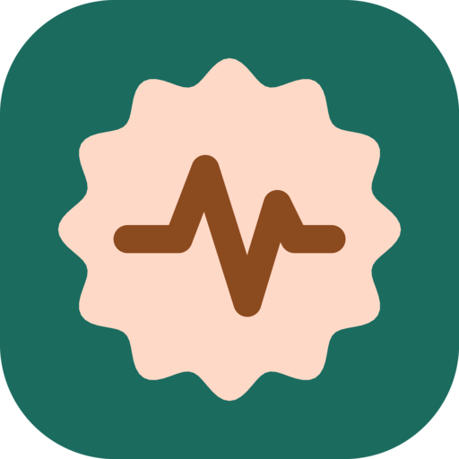
  <h1>Pulse</h1>
  <p><strong>A health app for Android in Material 3 Expressive. It reads your data from Health Connect, keeps up to ten years of it on the phone, and sends nothing anywhere.</strong></p>

  <p>
    
    
    
    
    
    
    
    
  </p>
</div>

---

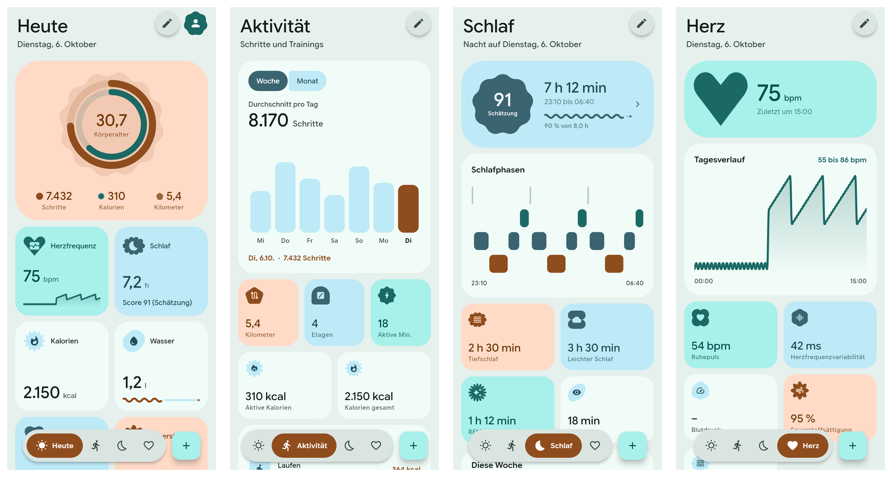

Every image on this page is rendered by the widget tests from **fixture data**, not from a person's health records. They show the app in **English**; it also speaks German and Polish.

---

## Contents

- [What It Is](#what-it-is)
- [The Pages](#the-pages): [Today](#today), [Activity](#activity), [Sleep](#sleep), [Heart](#heart)
- [Goals and Body Age](#goals-and-body-age)
- [Look and Motion](#look-and-motion)
- [Making It Yours](#making-it-yours)
- [The Scores](#the-scores)
- [Measurements](#measurements)
- [Architecture Overview](#architecture-overview)
- [Platform Support Matrix](#platform-support-matrix)
- [Permissions](#permissions), [Building and Running](#building-and-running), [Data Storage](#data-storage--disk-paths)
- [Known Limits](#known-limits)

---

## What It Is

**Pulse** is a **Flutter** app with one data source: **Health Connect** on the phone. Steps, sleep, heart rate, workouts and the rest arrive from the phone, a **Fitbit** or any other app that writes there, without a separate sign-in.

There is no server, no account and no analytics. A release build does not hold the **`INTERNET`** permission.

| Page | Shows | Opens |
| :--- | :--- | :--- |
| **Today** | The day as an animated scene with its score, two rings, hints, goals and the user's own tiles | One day, all days, a metric, the body age |
| **Activity** | The latest workout as a scene, the ones before it to swipe through, steps by week and month | One workout, all workouts |
| **Sleep** | The latest night played back, the nights before it, a bedtime for tonight, the stages | One night, all nights |
| **Heart** | A figure whose heart beats at the last measured rate, the day's curve, vitals, time in zones | A metric |
| **Profile** | Date of birth and sex, goals, theme, the look switches, language | The goals page |

---

## The Pages

Each main page has **one scene**, drawn and animated by the app, as its only large container. A **shape** with the page's main number hangs over the scene's edge, and the other numbers stand free below it.

### Today

- **The Day as a Scene:** The scene stands at the time it is, under a sky that follows the time of day; a day that is over stands at its evening. Nothing is played back: only what is in the picture moves, the stars, the clouds and the figure.

- **Recovery:** How rested the day began, from 0 to 100 %, on a shape in the colour of its zone: red up to 33, yellow up to 66, green above. It stands on the left of the scene's edge, like the main number of every page.

- **Day Score:** From nine in the evening the score of the day comes in beside it, in the middle, on a shape of the same size. A day that is over always shows both. See [The Scores](#the-scores).

- **Two Rings:** **Steps** outside and **active calories** inside, each against its goal, around the **body age**. A ring that has reached its goal turns into a **wave** that travels slowly around it.

- **The Hours So Far:** Beside the rings each number has its goal in words and a row of small bars from midnight to the running hour. The ring says how far the day has come, the bars say when.

- **Against Yesterday at This Time:** One sentence sets today's steps against yesterday's up to the same minute, so a morning is not compared with a whole day.

- **Hints:** Up to three, from fixed rules over the user's own numbers. Not medical advice.

- **The Days Before:** Cards to swipe through, each with its sky and score, and a last one that opens the list of every day.

- **A Page per Day:** The score with what each part gave, the day in numbers with marks for a **personal best**, each number against the day before and the week before, the night and the workouts of that day.

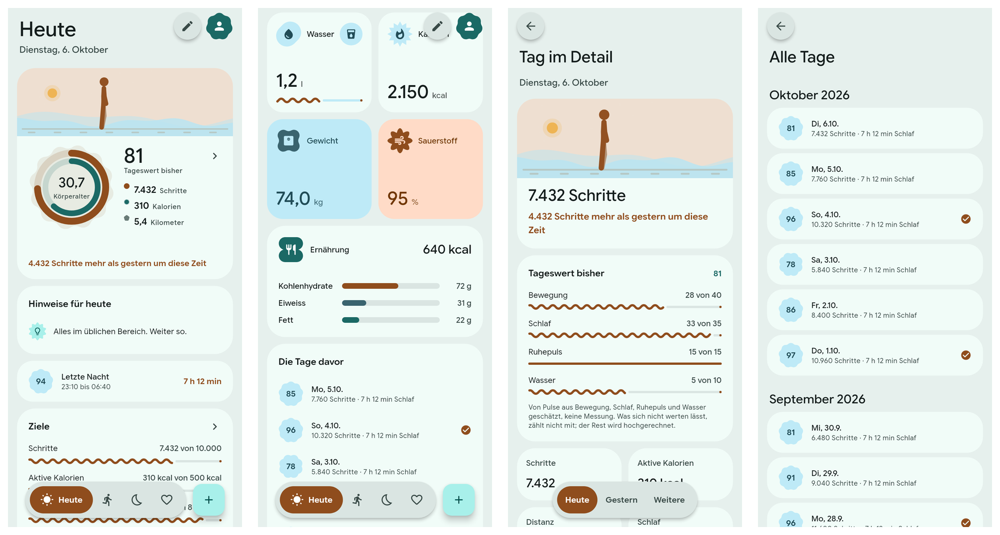

### Activity

- **The Latest Workout as a Scene:** A figure walks, runs, hikes, rides, swims, lifts or breathes in front of a passing landscape. The page has no score, so the shape over the scene's edge carries the **kind of workout**.

- **More Activities:** The five workouts before it as cards, and the way to all of them.

- **Steps by Week and Month:** The average per day stands large above the chart.

- **A Page per Workout:** Every number with a mark for a personal best, each number against the workout before and the average of the last ones, a chart of the last twelve of the kind, and how often per week.

- **All Activities:** Month by month, with a filter for the kind.

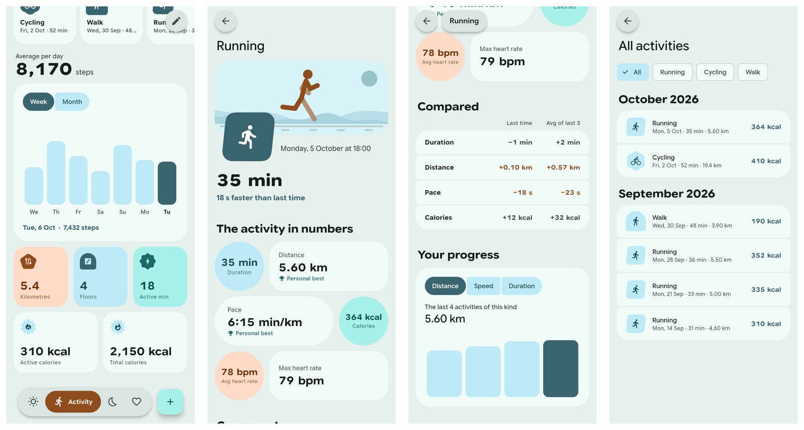

### Sleep

- **The Night Played Back:** The latest night runs in twelve seconds. The sky follows the stages, darkest in deep sleep and with dawn at the end; the figure snores in deep sleep, dreams in REM and sits up whenever the user was awake.

- **Tonight:** A bedtime counted back from the usual time of getting up, a little earlier while the week is in debt. It is the page's one loud tile.

- **A Page per Night:** The score in its four parts, the night in numbers, the stages as blocks, each stage against a guide range, bedtime and waking of the last 30 days, and the sleep debt of seven nights.

- **Observations:** How nights after a workout, or after a day above the step goal, differ. They need five nights on each side and are worded as what went together, not as a cause.

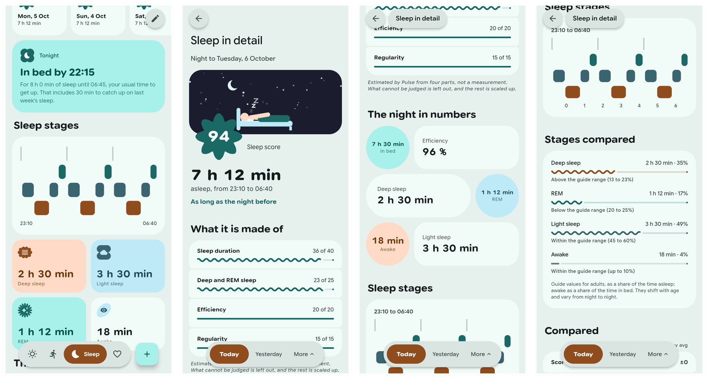

### Heart

- **A Heart That Beats at Your Rate:** The figure sits still, a heart beside its chest swells at the last measured rate, and the line of a heart monitor passes behind it with one spike per beat. The large heart over the scene's edge beats at the same rate.

- **Over the Day:** The day's curve on its own surface.

- **Vitals:** Resting heart rate, variability, blood pressure, oxygen saturation, respiratory rate and skin temperature, where the source records them.

- **Time in Zones:** Four segments; the zone with the most time is the loud one.

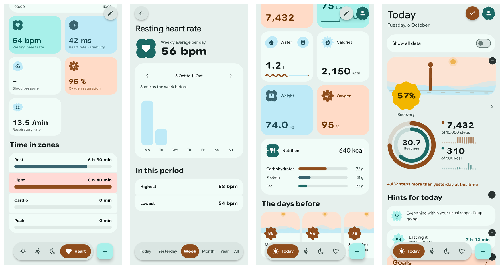

---

## Goals and Body Age

### Goals

Twelve goals in four groups, each switched on and off on its own and each with its own target. Four are on at first: steps, active calories, sleep duration and water.

| Group | Goals | Counted Over |
| :--- | :--- | :--- |
| **Movement** | Steps, active calories, active minutes, distance, floors | A day |
| **Sleep and water** | Sleep duration, sleep score, water | A day |
| **Training** | Workouts, training time | A week from Monday |
| **Nutrition** | Calories eaten (a limit to stay under), protein | A day |

The goals page has tabs floating at the bottom:

| Tab | Shows |
| :--- | :--- |
| **Today** | Each goal as a wavy line with its value and target |
| **Week** | Each day as a mark: a filled scalloped shape for reached, a ring for missed, a half-filled circle for still open, a dot for no data |
| **Month** | The same as a calendar; a weekly goal has one mark a week |
| **Year** | The share reached in each month as twelve bars |

A streak of two or more days (or weeks) is named on the goal's card.

### Body Age

The **body age** is the real age plus or minus some years, judged over the last 30 days. Its page lists every factor with the user's value, the value it is judged against and the years it adds or takes. It needs the **date of birth** from the profile.

| Factor | Read From |
| :--- | :--- |
| **Movement** | Steps, intensity minutes, strength training |
| **Sleep** | Duration, regularity of bedtime and waking |
| **Heart** | Resting heart rate, heart rate variability, blood pressure |
| **Body** | Body fat, or body mass index when there is none |

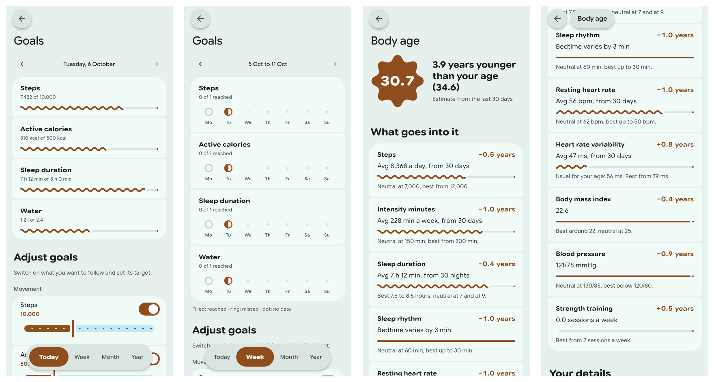

---

## Look and Motion

The app follows **Material 3 Expressive**: few containers, heavy free-standing type, shapes that mean something, and motion on springs.

- **One Accent per Page:** Today takes the primary tone, Activity the secondary, Sleep the tertiary and Heart the error tone. Sub pages keep the accent of the page they were opened from.

- **Shapes by Family:** Scores sit on shapes of the page's family, from a plain one for a low score to the most pronounced for a high one.

- **Segments Instead of Cards:** Lists are groups of segments with small gaps under a free title; a chart stands alone on its surface.

- **Edge-to-Edge Scene:** A switch in the profile, **off by default**. The scene of each main page then runs from the top of the screen behind the title and fades into the page.

- **Flex Font:** A second switch, **off by default**. Large numbers and titles use the width and weight axes of **Google Sans Flex**, and a number grows heavier while it counts.

- **Pages That Wake Up:** Tiles come in one after the other. Numbers count up, rings and bars fill, and they fill again when the page comes back into view. With animations switched off in the system everything is simply there.

- **Navigation You Can Drag:** The selected pill of the floating bar can be dragged to another destination. The period tabs work the same way, and the selected tab grows a little while the others give way.

- **Material You:** The colour scheme follows the phone's wallpaper, or the app's own palette when switched off. Light, dark or system.

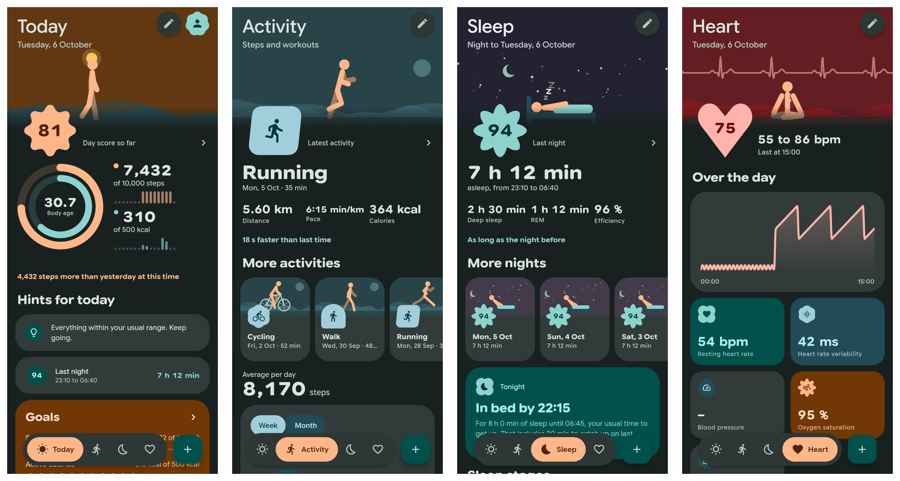

### Liquid Glass

A third switch in the profile, **off by default**. Shapes, colours and motion stay as they are; only the material changes.

| Piece | As Glass |
| :--- | :--- |
| **Navigation bar**, **period tabs** | Clear glass that bends the page beneath it at its edge |
| **Selected pill** | A second piece of glass on its bar, tinted in the primary colour; a clear lens while it is dragged |
| **Add button and its menu** | Glass drops in one blend group: the entries flow out of the button and merge back into it |
| **Floating buttons**, **title pill** | Glass like the navigation bar |
| **Tiles** | Translucent glass over soft colour fields, without refraction |

The refraction comes from **`liquid_glass_renderer`**, which needs **Impeller**. Without it the app falls back to a plain blur.

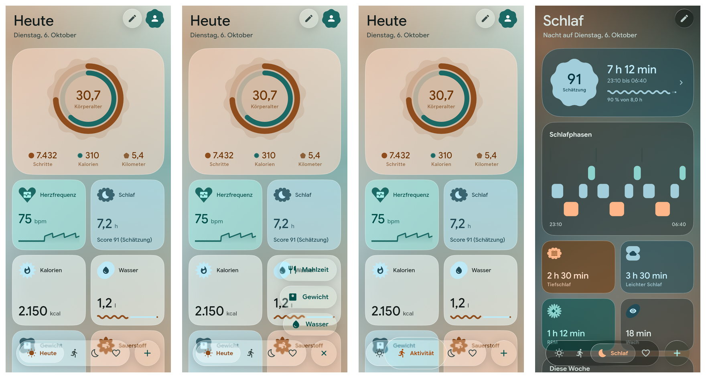

This image shows the **blurred fallback**, because the test renderer has no Impeller. On a phone the bars, their pills and the add button also bend what is behind them.

---

## Making It Yours

- **Everything Is a Tile:** In edit mode every tile has a **minus** to remove it; a list below the board offers what was removed and, on Today, every measurement with data. Hold a tile and drag it; the order is saved per page.

- **Two Sizes:** A measurement tile on Today is **small** (half width, the value) or **large** (full width, with the last seven days as bars, or today's curve for the heart rate).

- **Own Entries:** **Water**, **weight** and **meals** from the **+** button, written to Health Connect. The water tile has a button for one glass of **250 ml**. Entries made by Pulse can be edited and deleted; entries from other apps cannot, because Health Connect does not allow it.

- **Three Languages:** **German**, **English** and **Polish**, with numbers, dates and plurals as each language writes them (**7.432** / **7,432** / **7 432**). On **Android 13** and newer the choice is the language Android keeps per app. Units stay metric.

- **Ten Years of History:** One value per day and metric, in one file per calendar year. Older data already in Health Connect is loaded once, in **90-day** stretches.

- **Background Refresh:** A **WorkManager** task refreshes the stored data about once an hour, so no day is lost if the app stays closed for longer than Health Connect's 30-day window.

---

## The Scores

All three are the app's own rules, not measurements; Health Connect stores none. A part that cannot be judged is left out and the rest scaled to a hundred.

### Recovery

It takes the readings a recovery is commonly judged by, the scale from 0 to 100 % and the three zones. The weights and the curve are this app's own, so the number resembles that of a wearable's own app and will not equal it.

| Part | Weight | Judged Against |
| :--- | :--- | :--- |
| **Heart rate variability** | **50** | The own average of the 30 days before; higher is better |
| **Resting heart rate** | **20** | The own average of the 30 days before; lower is better |
| **Sleep** | **20** | Time asleep in the night before against the sleep goal |
| **Respiratory rate** | **10** | The own average of the 30 days before; only breathing faster than that counts against |

A reading at its own average gives six tenths of its part, and one standard deviation to the better or worse side two tenths more or less. A part needs five earlier days to be set against. Without heart rate variability and without resting heart rate there is no recovery.

### Day Score

| Part | Points | Judged Against |
| :--- | :--- | :--- |
| **Movement** | up to **40** | Steps (five eighths) and active calories against their goals |
| **Sleep** | up to **35** | The sleep score of the night that ended that day |
| **Resting heart rate** | up to **15** | The upper end of the own usual range of the 30 days before; nothing at 10 beats above it |
| **Water** | up to **10** | The water goal, only for somebody who enters what they drink |

For today it is the score **so far** and grows with the day, which is why Today shows it only from nine in the evening.

### Sleep Score

| Part | Points | Judged Against |
| :--- | :--- | :--- |
| **Time asleep** | up to **40** | The sleep goal |
| **Deep and REM** | up to **25** | The lower end of what is typical for each share |
| **Efficiency** | up to **20** | Between 70 and 90 % of the time in bed |
| **Bedtime** | up to **15** | Within 15 to 90 minutes of the mean of the week before |

---

## Measurements

**32** metrics in five groups. A day's value follows one rule per metric: the **sum** of the day, the **average** of its readings, or the **last** reading.

| Group | Metrics | Day Rule |
| :--- | :--- | :--- |
| **Activity** | Steps, distance, floors, active calories, total calories, intensity minutes | **Sum** |
| **Activity** | Speed | **Average** |
| **Vitals** | Heart rate, heart rate variability, oxygen saturation, respiratory rate, blood glucose, body temperature, skin temperature | **Average** |
| **Vitals** | Resting heart rate, blood pressure (systolic, diastolic) | **Last** |
| **Body** | Weight, height, body mass index, body fat, lean mass, body water, basal metabolic rate | **Last** |
| **Sleep** | Sleep duration, with stages where the source records them | **Sum** |
| **Nutrition** | Water, calories eaten, carbohydrates, protein, fat, fibre, sugar | **Sum** |

**Workouts** are read as sessions with type, duration, distance, calories and steps.

**Not included:** elevation gained, power, **VO2 max**, bone mass and mindfulness sessions, because the **`health`** plugin cannot read them on Android. Cycle tracking and medical records are deliberately not requested.

### Period Tabs

| Tab | Bars | Headline |
| :--- | :--- | :--- |
| **Today** / **Yesterday** | Hours of the day, where available | The day's value |
| **Week** | Monday to Sunday | Average per day |
| **Month** | Days of the month | Average per day |
| **Year** | Twelve months | Average per day |
| **All** | Years, up to ten | Average per day |

An average counts only days **with** data; a day without a measurement is not a zero. Month and year bars show the daily average, so a month that has just begun does not look smaller than a full one.

---

## Architecture Overview

One file in the code base talks to the **`health`** plugin. Everything above it works on plain Dart values and is tested without a device.

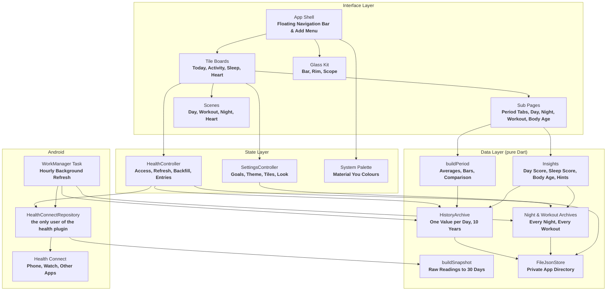

### How a Refresh Flows

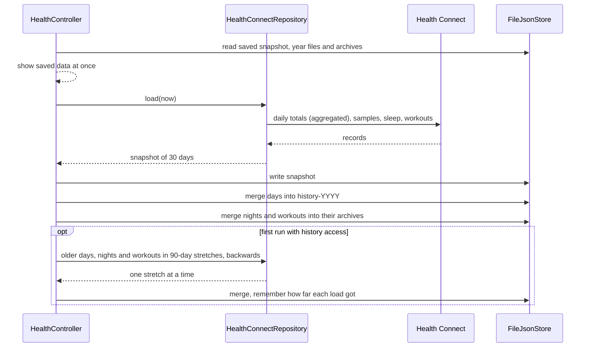

---

## Platform Support Matrix

| Platform | Runner | Status |
| :--- | :--- | :--- |
| **Android 8.0+** (API 26) | **`android/`** | ***Tested*** in part, see below |
| **Linux** | **GTK3** (`linux/`) | ***Built.*** For development only; it has no health data source and shows a notice |
| **iOS, macOS, Windows, Web** | none | Not supported. Health Connect exists only on Android |

### What Has Been Verified

Everything above the plugin is ***tested*** by **557** unit and widget tests against an in-memory fixture store, at **360 x 640** and **412 x 915**, in all three languages.

| Area | Status |
| :--- | :--- |
| **Reading Health Connect** | ***Tested*** on a **Pixel 10 Pro**: 30 days of real data, and older data back to 2017; steps and energy agreed with the Fitbit app once it had synced |
| **Writing, editing, deleting an entry** | ***Tested*** on an **Android 17** emulator with an empty Health Connect: water written, changed and shown; a meal written and deleted. Not tried on a phone with real data |
| **Backup** | ***Tested*** by unit and widget tests, and on the emulator: saved through the system's file dialog, a stored year removed, the file read back, the year identical to before |
| **Refresh in the background** | ***Tested*** on the emulator: a run read Health Connect and stored the result while the app was open. A run with the app closed, and any run on a phone, is not confirmed |
| **The four main pages and their sub pages** | ***Tested*** by widget tests in the three languages at both sizes, with and without glass, edge-to-edge scene and flex font, and as rendered images; looked at on the **Pixel 10 Pro** |
| **Scores, hints, goals, body age** | ***Tested*** by unit tests of every rule and every kind of goal |
| **Recovery** | ***Tested*** by unit tests of every part and by widget tests of the one shape by day and the two in the evening; looked at as rendered images from fixture data. With real readings it is ***built*** only: whether the watch writes heart rate variability and respiratory rate to Health Connect is not known |
| **Motion** | ***Tested*** as values: entrances run once per opening, rings and bars fill again on return, the wave on a full ring travels, and all of it stands still with animations off. How it feels and whether it stays smooth is not measured |
| **Loading older nights and workouts** | ***Tested*** against the fixture store, ***built*** against Health Connect |
| **Language choice** | ***Tested*** on an **Android 17** emulator: set in the profile and read back with `cmd locale get-app-locales` |
| **Liquid Glass** | ***Tested*** by widget tests in the blurred fallback, and by stills on a **Pixel 8** emulator under **Vulkan** before the pages were reworked. The current pages with glass are ***built*** only |
| **Polish text** | Not reviewed by a native speaker |

---

## Permissions

| Permission | Why |
| :--- | :--- |
| **26 `READ_*`** health permissions | One per data type listed above |
| **`WRITE_HYDRATION`**, **`WRITE_WEIGHT`**, **`WRITE_NUTRITION`** | The three kinds of entries you can add |
| **`READ_HEALTH_DATA_HISTORY`** | Loading data older than 30 days once. If declined, history only grows from today |
| **`READ_HEALTH_DATA_IN_BACKGROUND`** | The hourly refresh. If declined, data is refreshed when the app is opened |

Neither the app's manifest nor those of its plugins declare the **`INTERNET`** permission for a release build.

---

## Prerequisites

- **Flutter SDK** 3.47 or newer (**Dart** 3.13).
- **Android SDK** with platform tools, and a phone with **Health Connect** (built into Android 14 and newer; an app from the Play Store before that).
- For the Linux development build on **Fedora**:
  ```bash
  sudo dnf install clang cmake ninja-build gtk3-devel
  ```

---

## Building and Running

**1. Clone the repository:**
```bash
git clone https://github.com/tomsliikee/pulse.git
cd pulse
```

**2. Fetch dependencies** (this also generates the translations from the ARB files):
```bash
flutter pub get
```

**3. Run the checks:**
```bash
flutter analyze
flutter test
```

**4. Run on a connected phone:**
```bash
flutter run -d android
```

**5. Build and install an APK:**
```bash
flutter build apk --debug
adb install -r build/app/outputs/flutter-apk/app-debug.apk
```

On first start the app asks for access to Health Connect, then once for older data. Both dialogs belong to the system; the app works with whatever you allow.

---

## Data Storage & Disk Paths

Everything is kept in the app's private support directory (**`/data/data/at.haiden.pulse/files/`**). Uninstalling the app deletes it. **Profile → Backup** writes the history, the nights, the workouts and the settings into one JSON file at a place you choose, and reads such a file again: days, nights and workouts that are missing are added, what is already there stays as it is, and the settings are only taken where the app has none yet.

| File | Purpose |
| :--- | :--- |
| **`snapshot.json`** | The last 30 days in full: daily values, sleep stages, heart samples, workouts, entries |
| **`history-YYYY.json`** | One value per day and metric for that calendar year. Files older than ten years are removed at start |
| **`nights-YYYY.json`** | Every night that ended in that calendar year: its times and the minutes in each stage, without the curve |
| **`workouts.json`** | Every workout the app has seen, oldest first |
| **`settings.json`** | Goals with their switches and targets, date of birth and sex, theme, the switches for Material You, Liquid Glass, edge-to-edge scene and flex font, the language (only before Android 13), tile order per page, the tiles on Today and their sizes |
| **`sync.json`** | When the last refresh in the background ended, how long it took, or why it stored nothing. Shown in the profile |
| **`backfill.json`**, **`nightBackfill.json`**, **`workoutBackfill.json`** | How far back each one-time load of older data has reached |

Every value read from disk or from Health Connect is checked against the bounds in the metric catalog; a reading outside them is dropped.

---

## Known Limits

- **Heart rate:** Single samples are loaded for the last **8 days**. The daily average is therefore not backfilled and only builds up from use; resting heart rate is.

- **Workouts:** The heart rate of a workout is only known if the app read it within those **8 days**. There are no routes or maps.

- **Nights:** The curve of the stages exists for the last 30 days only; older nights keep their times and the minutes in each stage.

- **One-time loads:** A failed read of one stretch of older nights or workouts is not retried.

- **Hourly values:** Only for steps, distance, active and total calories, water and intensity minutes, and only for today and yesterday. Today is therefore set against yesterday at this time, not against a week, and an older day's scene is played from its total.

- **Scores and body age:** The app's own estimates. The values they are judged against follow common guidance; the points and years each part is worth are constants of this app and are not validated. None of them is a medical statement, and the body age does not use **VO2 max**, which the plugin cannot read.

- **Liquid Glass:** Relies on a pre-release package. Tiles do not refract, because that made scrolling stutter. Sub pages and sheets stay solid; only their floating tabs, back button and title pill are glass.

- **Heart page:** With an odd number of vitals the last one leaves a gap beside it.

- **Orientation:** Portrait only.

---

## Dependencies

| Package | Used For |
| :--- | :--- |
| **`material_ui`** | The Material widget library |
| **`m3e_core`** | Material 3 Expressive components: floating toolbar, FAB menu, toggle button group, shapes, wavy progress |
| **`motor`** | Spring motion |
| **`health`** | Health Connect |
| **`workmanager`** | Background refresh |
| **`dynamic_color`** | The system colour palette |
| **`liquid_glass_renderer`** | The refracting glass of the Liquid Glass switch; Flutter itself can only blur |
| **`path_provider`** | The private directory |
| **`flutter_localizations`**, **`intl`** | The translations generated from **`lib/l10n/app_*.arb`**, and numbers and dates per language |

The bundled typeface is **Google Sans Flex**, under the **SIL Open Font License** (see [`assets/fonts/OFL.txt`](assets/fonts/OFL.txt)).

---

## License

Released under the **MIT License**, see [`LICENSE`](LICENSE).
